# `Practica Final  GitHub Acions:`

## [🔸LINTER-JOB:](https://github.com/Vicent29/Proyecto-Final-GitHub-Actions/blob/master/.github/workflows/vicent_GhActions_workflow.yml)

- En primer lugar, realizaremos el job de linter, para ello crearemos en “ ___./github/workflows___” el workflow de “__vicent_GhActions_workflow.yml__”:

    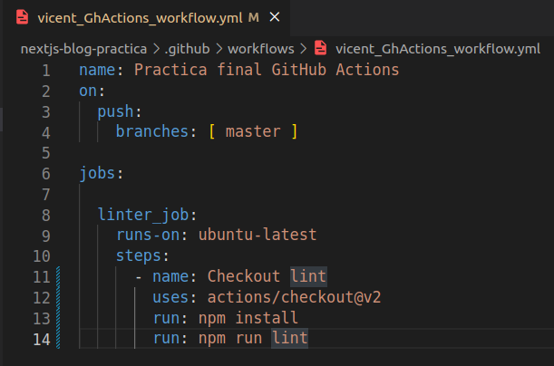

- Nos saltara errores en los archivos de [__./pages/api/users/[id].js__](https://github.com/Vicent29/Proyecto-Final-GitHub-Actions/blob/master/pages/api/users/%5Bid%5D.js) y [__./pages/api/users/index.js__](https://github.com/Vicent29/Proyecto-Final-GitHub-Actions/blob/master/pages/api/users/index.js) .Para solucionarlos  tendremos que modificar las comillas simples por comillas dobles y una variable var por const o let.

    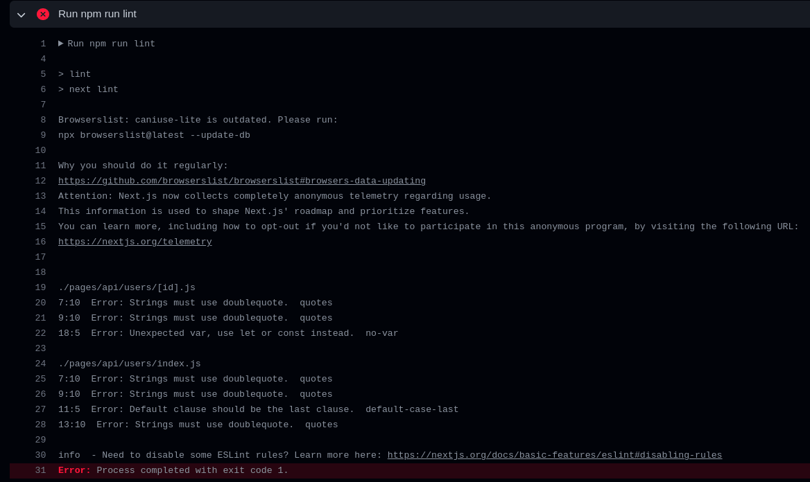

    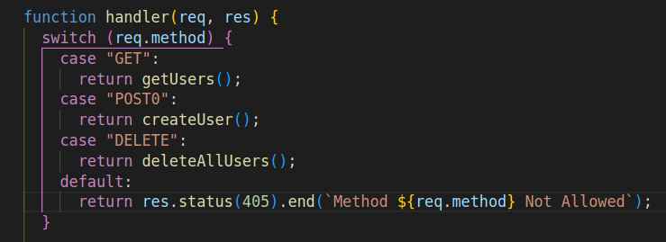

- Por último, realizaremos de nuevo el push y el linter_job debería de salir correctamente:

    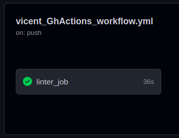
---
## [🔸CYPRESS-JOB:](https://github.com/Vicent29/Proyecto-Final-GitHub-Actions/blob/master/.github/workflows/vicent_GhActions_workflow.yml)

- Seguidamente añadiremos al workflow el job de “`crypess_job`”  que será el encargado de ejecutar los tests de cypress guardando el resultado en una archivo llamado “___result.txt___”.

   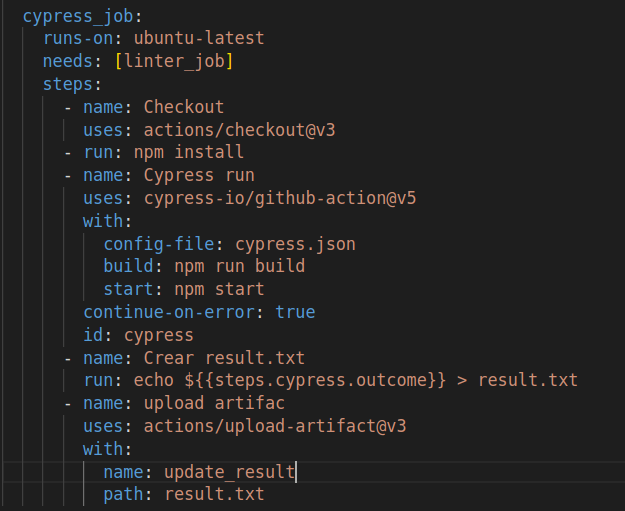

- Los test han fallado, después de estar buscando, el error sucedía por motivo de que en el __case__ de “`POST`” tenía un 0 (“__POST0__”).

    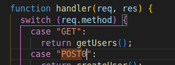

    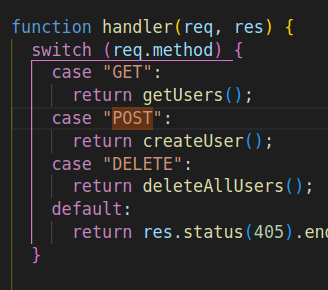

- Finalmente, realizamos el push y podremos ver como nos genera una tabla con las estadísticas de los  test y un __.zip__ con el nombre de “`update_result`” que contiene el “`result.txt`”

    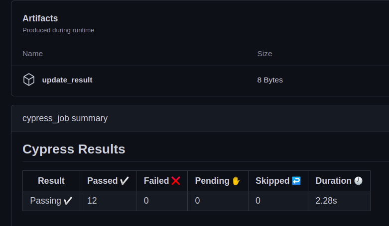

    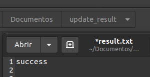

---
## [🔸ADD-BADGE-JOB:](https://github.com/Vicent29/Proyecto-Final-GitHub-Actions/blob/master/.github/workflows/vicent_GhActions_workflow.yml)

- Este job, se encargará de coger el resultado de los test de `cypress`, a partir del archivo “`result.txt`” que hemos creado en el job anterior. Y dependiendo del resultado modificaremos el [Readme](https://github.com/Vicent29/Proyecto-Final-GitHub-Actions/blob/master/README.md) con un badge u otro.

    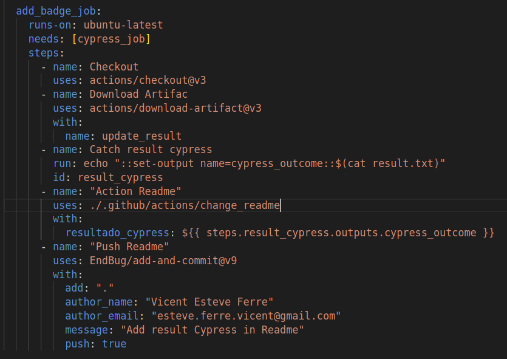

- A continuación he creado la estructura de la action con su respectivo archivo “[action.yml](https://github.com/Vicent29/Proyecto-Final-GitHub-Actions/blob/master/.github/actions/change_readme/action.yml)”, “[index.js](https://github.com/Vicent29/Proyecto-Final-GitHub-Actions/blob/master/.github/actions/change_readme/index.js)” (al termniar lo he compilado con la dependencia "__ncc__")

    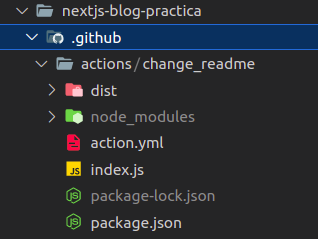

- Seguidamente, crearemos la action en “[.github/actions/change_readme/action.yml](https://github.com/Vicent29/Proyecto-Final-GitHub-Actions/blob/master/.github/actions/change_readme/action.yml)”:

    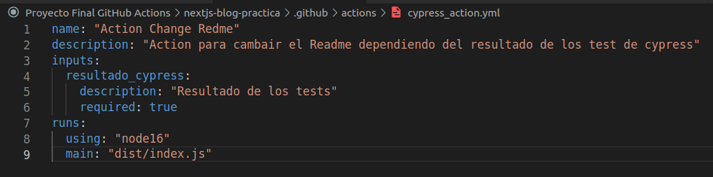

- Por último, en el “[index.js](https://github.com/Vicent29/Proyecto-Final-GitHub-Actions/blob/master/.github/actions/change_readme/index.js)” se encargará de leer y reescribir el [Readme](https://github.com/Vicent29/Proyecto-Final-GitHub-Actions/blob/master/README.md) dependiendo de una variable que contendrá el resultado de los test de cypress a partir de la variable del Workflow. Por otro lado instalaremos todas las dependencias necesarias (“`actions/core`”, “`actions/github`”, “`vercel/ncc`”)  y he compilado el “[index.js](https://github.com/Vicent29/Proyecto-Final-GitHub-Actions/blob/master/.github/actions/change_readme/index.js)”.

    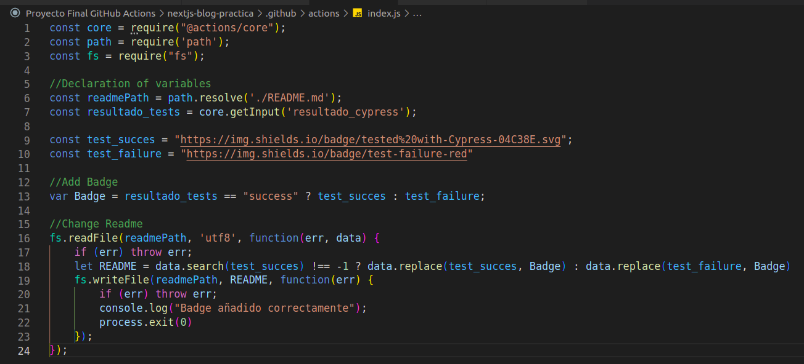

- Finalmente, he comprobado que ha salido correctamente  y que el [README.md](https://github.com/Vicent29/Proyecto-Final-GitHub-Actions/blob/master/README.md) ha cambiado y se ha añadido el Badge de test success:

    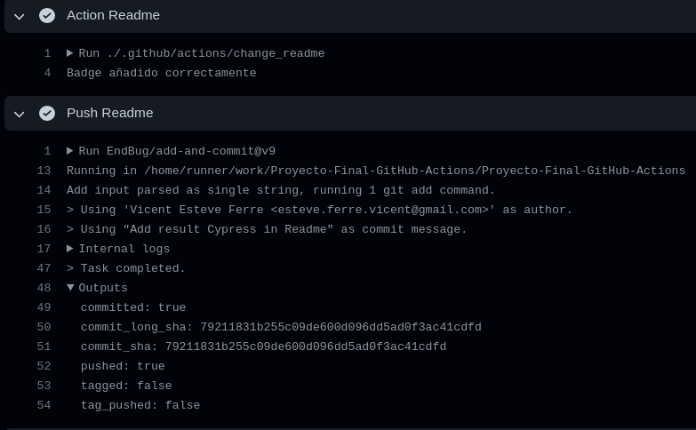
    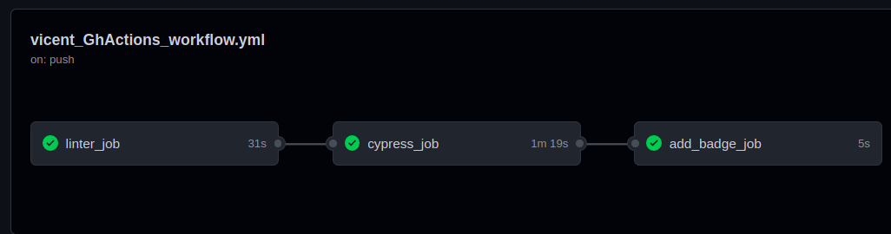
    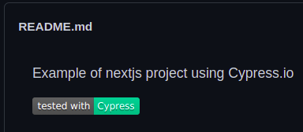

---
## [🔸DEPLOY-JOB ](https://github.com/Vicent29/Proyecto-Final-GitHub-Actions/blob/master/.github/workflows/vicent_GhActions_workflow.yml)(Vercel):

- Este job se encargará de  realizar un deploy en `vercel`, para ello me he creado una cuenta y he creado los diferentes secrets que son necesarias para el funcionamiento de la action de `amondnet/vercel-action@v20`

    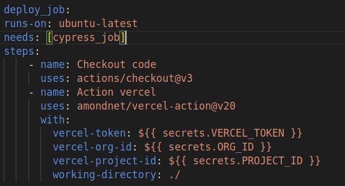
    

- Además tendremos que crear un proyecto y vincularlo con el repositorio de github de la práctica.

	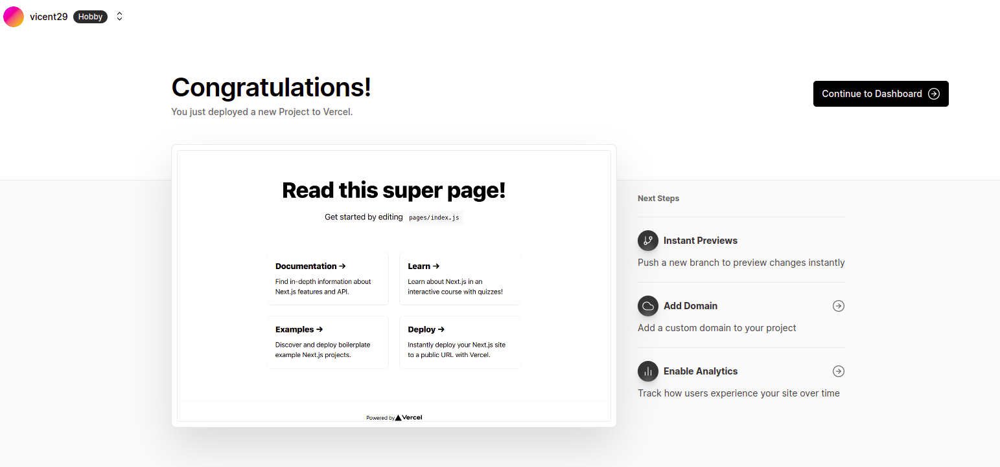

- Finalmente, funcionó correctamente y si entramos en vercel tendremos el proyecto ( [Desplegamiento del proyecto](https://proyecto-final-git-hub-actions.vercel.app/)): 

    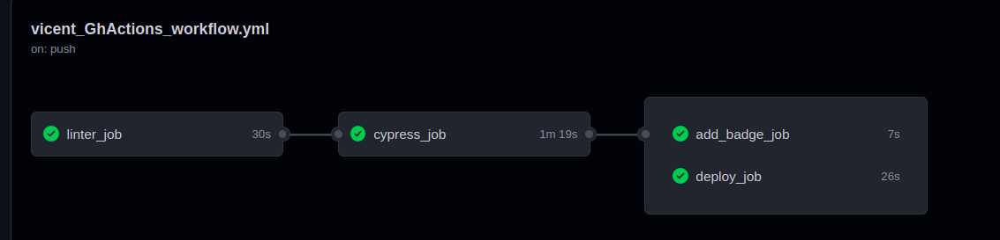

---
## [🔸NOTIFICATION-JOB](https://github.com/Vicent29/Proyecto-Final-GitHub-Actions/blob/master/.github/workflows/vicent_GhActions_workflow.yml)

- La función de este job, es la de crear un email mediante una action que hemos creado con el servicio de [mailgun](https://www.mailgun.com/), que se encargará de enviar un email de los resultados de los anteriores jobs independientemente de su resultado:

	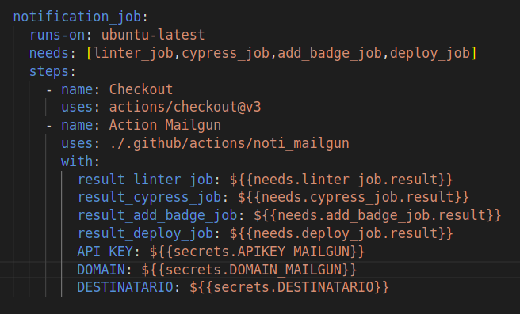

- Además, tendremos que añadir las variables que requiere Mailgun (`APIKEY_MAILGUN` y `DOMAIN_MAILGUN`):

	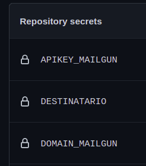

- Seguidamente crearemos la action de “`noti_mailgun`”, en la cual pasaremos todas las variables que tendremos que utilizar después es su configuración del “[index.js](https://github.com/Vicent29/Proyecto-Final-GitHub-Actions/blob/master/.github/actions/noti_mailgun/index.js)” y una vez hemos probado que en local nos ha enviado el correo correctamente, compilamos con la dependencia de “`ncc`”:
	[index.js send_mailgun](https://github.com/Vicent29/Proyecto-Final-GitHub-Actions/blob/master/.github/actions/noti_mailgun/index.js)
- Como resultado, nos enviara el siguiente email:

	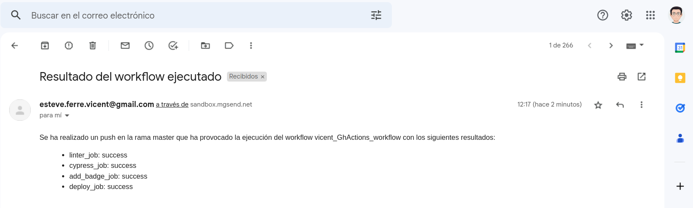

---
## [🔸ADD-METRICS:](https://github.com/Vicent29/Vicent29/blob/master/.github/workflows/metrics_workflow.yml)

- En este apartado, se encargará de añadir métricas al repositorio del profile de github. En primer lugar,  dentro del repositorio de “Vicent29” hemos creado el workflow, el cual tendrá un único job que utilizara la action de “lowlighter/metrics@latest”. 
	
    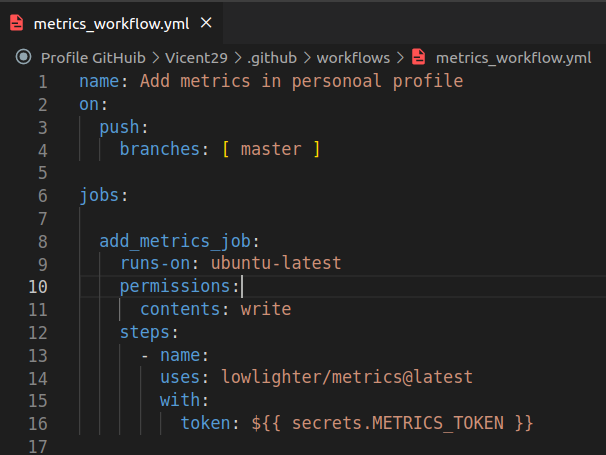

- Para que la action saque correctamente las métricas he creado un secret  con el nombre de “METRICS_TOKEN” que contiene un token creado con permisos específicamente para la action.

	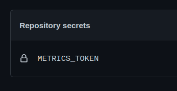

- Finalmente, añadiremos en el [README PROFILE](https://github.com/Vicent29/Vicent29) la siguiente línea y  realizamos el push.
	```
    
    ```

	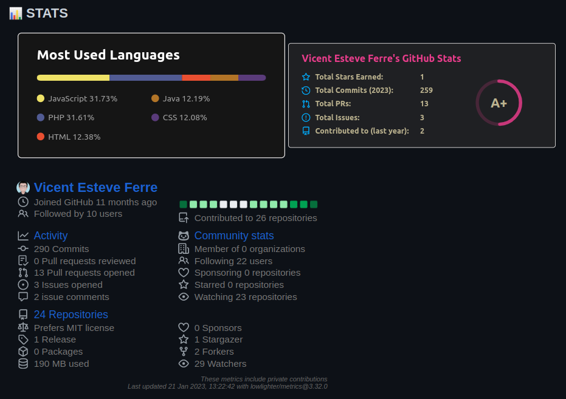
---
## Result test ___CYPRESS___:

<!---Start place for the badge -->
[](https://www.cypress.io/)

<!---End place for the badge -->
